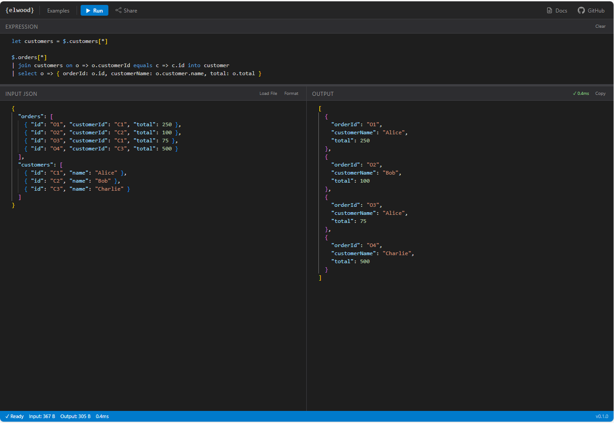

# Elwood

A functional JSON transformation DSL with KQL-style pipes, LINQ-style lambdas, and JSONPath navigation.

```
$.orders[*]
| where o => o.status == "confirmed" && o.total > 100
| select o => {
    id: o.id,
    customer: o.customerName,
    total: o.total,
    priority: o.priority | match "high" => "URGENT", _ => "normal"
  }
| orderBy o => o.total desc
| take 10
```

Available as a **.NET library** (NuGet) and a **TypeScript/JavaScript package** (npm). Both implementations are behaviorally identical, validated by a shared conformance test suite.

**[📖 Syntax Reference →](docs/syntax-reference.md)**

**[🎮 Try it in the Playground →](https://max-favilli.github.io/elwood/)**

[](https://max-favilli.github.io/elwood/)

---

## Quick Start

### TypeScript / JavaScript

```bash
npm install @elwood-lang/core
```

```typescript
import { evaluate } from '@elwood-lang/core';

const data = {
  users: [
    { name: 'Alice', age: 30, active: true },
    { name: 'Bob', age: 17, active: true },
    { name: 'Charlie', age: 25, active: false },
  ]
};

const result = evaluate('$.users[*] | where u => u.active && u.age >= 18 | select u => u.name', data);
console.log(result.value); // ["Alice"]
```

### .NET

```bash
dotnet add package Elwood.Core
dotnet add package Elwood.Json
```

```csharp
using Elwood.Core;
using Elwood.Json;

var engine = new ElwoodEngine(JsonNodeValueFactory.Instance);
var input = JsonNodeValueFactory.Instance.Parse(json);

var result = engine.Evaluate("$.users[*] | where u => u.active | select u => u.name", input);
// result.Value contains the transformed JSON
```

### CLI

```bash
# Evaluate an expression
elwood eval "$.users[*] | where u => u.active" --input data.json

# Run a script
elwood run transform.elwood --input data.json

# Interactive REPL
elwood

# Pipe from stdin
echo '{"x": 42}' | elwood eval "$.x * 2"
```

---

## Language Features

### Pipes
Data flows left-to-right through pipe operators:
```
$.items[*] | where x => x.price > 10 | select x => x.name | distinct | take 5
```

### Pipe Operators
| Operator | Description |
|---|---|
| `where` | Filter items by predicate |
| `select` | Transform each item |
| `selectMany` | Flatten nested arrays |
| `orderBy` | Sort (multi-key, asc/desc) |
| `groupBy` | Group by key → `{ key, items }` |
| `distinct` | Remove duplicates |
| `take` / `skip` | Slice the array |
| `batch` | Chunk into groups of N |
| `join` | SQL-style join (inner/left/right/full) |
| `concat` | Join array into string |
| `reduce` | General-purpose fold |
| `count` / `sum` / `min` / `max` | Aggregation |
| `first` / `last` | Single element (optional predicate) |
| `any` / `all` | Boolean quantifiers |
| `match` | Pattern matching |
| `index` | Replace items with 0-based indices |

### Named Lambdas
```
x => x.name.toLower()
(acc, item) => acc + item.price
```

### Let Bindings
```
let adults = $.users[*] | where u => u.age >= 18
let names = adults | select u => u.name
return { names: names, count: adults | count }
```

### Pattern Matching
```
$.status | match
  "active" => "#00FF00",
  "retired" => "#FF0000",
  _ => "#999999"
```

### Memoized Functions
```
let lookup = memo id => $.categories[*] | first c => c.id == id
$.items[*] | select i => { name: i.name, category: lookup(i.catId).name }
```

### Spread Operator & Computed Keys
```
{ ...original, newProp: "added", [dynamicKey]: computedValue }
```

### 70+ Built-in Methods
String, numeric, datetime, crypto, null-checks, object manipulation, regex, URL encoding, and more. See the [syntax reference](docs/syntax-reference.md).

---

## Performance

The .NET engine uses lazy evaluation — pipe operators stream elements without materializing intermediate arrays. `take(10)` on a 100K-element pipeline processes ~15 items, not 100K.

```
where|select|take(10) on 100K items:    0.02ms avg
Full pipeline on 200K items (~73MB):    ~2s, 41K rows/sec
```

---

## Project Structure

```
Elwood/
├── spec/test-cases/      # 68 shared conformance test cases
├── dotnet/               # .NET implementation (C#)
│   ├── src/Elwood.Core/  # Parser, evaluator, built-in functions
│   ├── src/Elwood.Json/  # System.Text.Json adapter
│   └── src/Elwood.Cli/   # CLI tool
├── ts/                   # TypeScript implementation
│   └── src/              # Lexer, parser, evaluator, built-ins
└── docs/                 # Syntax reference, changelog, roadmap
```

Both implementations share the same conformance test suite (`spec/test-cases/`). Every test case includes an explanation file that serves as a tutorial.

---

## Documentation

- **[Playground](https://max-favilli.github.io/elwood/)** — Try Elwood in your browser
- **[Syntax Reference](docs/syntax-reference.md)** — Complete language reference
- **[Changelog](docs/changelog.md)** — Version history
- **[Roadmap](docs/roadmap.md)** — Future plans
- **[Test Cases](spec/test-cases/)** — 68 examples with explanations (also serve as tutorials)

---

## Building from Source

### .NET
```bash
dotnet build dotnet/Elwood.slnx
dotnet test dotnet/tests/Elwood.Core.Tests/
```

### TypeScript
```bash
cd ts
npm install
npm test
```

---

## License

[MIT](LICENSE)
